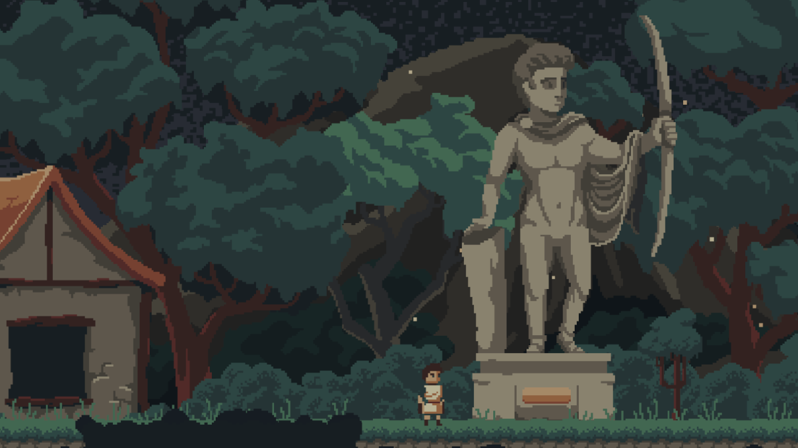
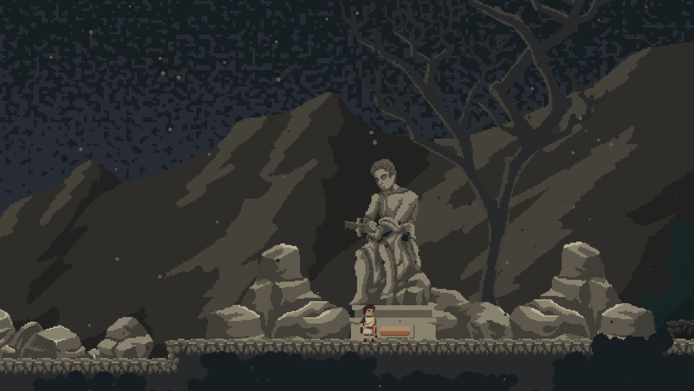

# Vincentius
## Pompeii is in danger.

Down below, within the crust of the earth, molten rock spews, and rivers of fire begin to flood.

Slowly but surely, the fires are climbing their way up the mountain you call Mount Vesuvius.

The Mountain can only contain the inferno for one more day. When the sundial hits noon, the flame will annex Pompeii, casting the land in fire.

Salus, the Roman goddess of welfare and safety, calls Vincentius to embark on a journey to the top of the mountain, in a desperate attempt to save Pompeii. The clock is ticking, as Vincentius only has 12 hours before the Pompeii is coated in ashes.

*He cannot do it alone.*

Join Vincentius on his journey up the mountain, and as he is thrown into the drama of Roman gods and goddesses. Who knows, maybe the eruption is what’s best for Rome.

**Play Now:** https://theshrimpchip.itch.io/vincentius

## Development
Vincentius was developed for the 2022 Florida Technology Student Association Conference. It was created using the Unity Game Engine, and other tools such as Aseprite, Krita, Photoshop, FL Studio, and many others. All assets were created by a team of high schoolers at North Port High School.

Developers include:
```
Evan Bertis-Sample: Lead Developer, Lead Artist, Lead Designer
Daniel Franco: Co-Music Director, Designer
David Fanco: Co-Music Director, Designer
```

Check out the official documentation submitted to the conference [here.](https://drive.google.com/file/d/1ny7HbLn9s310t4V2YfOaGgrpMm6uQyx5/view?usp=sharing)

### Screenshots




